# Document Q&A Chatbot

<div align="center">


**A free, local AI-powered chatbot that answers questions about your PDF documents using Retrieval-Augmented Generation (RAG).**

[Features](#features) • [Quick Start](#quick-start) • [Architecture](#architecture) • [Usage](#usage) • [Troubleshooting](#troubleshooting)

</div>

---

## Overview

Transform your PDF documents into an intelligent knowledge base! This chatbot uses advanced RAG (Retrieval-Augmented Generation) technology to provide accurate, context-aware answers to your questions - all running locally on your machine with complete privacy.

### Why Use This?

- **100% Free & Local** - No API keys, subscriptions, or cloud services required
- **Privacy First** - Your documents never leave your computer
- **Fast & Accurate** - FAISS vector search for instant, semantic retrieval
- **Natural Conversations** - Chat naturally with your documents
- **Multi-Document Support** - Query across multiple PDFs simultaneously
- **Source Citations** - See exactly where each answer came from

---

## Architecture

### System Architecture Diagram

```mermaid
graph TB
    A[📄 PDF Documents] --> B[Document Loader]
    B --> C[Text Splitter<br/>Chunk Size: 500<br/>Overlap: 50]
    C --> D[HuggingFace Embeddings<br/>all-MiniLM-L6-v2]
    D --> E[(FAISS Vector Store<br/>Semantic Search)]
    
    F[👤 User Query] --> G[Query Embeddings]
    G --> E
    E --> H[Retrieve Top-K<br/>Relevant Chunks]
    H --> I[Context + Query]
    I --> J[🦙 Ollama LLM<br/>Llama2]
    J --> K[Generated Answer<br/>+ Citations]
    K --> L[💻 Streamlit UI]
    
    style A fill:#e1f5ff
    style E fill:#fff3e0
    style J fill:#f3e5f5
    style L fill:#e8f5e9
```



### Workflow Overview


### RAG Pipeline Flow


---

## Features

### Core Capabilities

| Feature | Description |
|---------|-------------|
| **Zero Cost** | Completely free with no hidden fees or subscriptions |
| **Local Processing** | All data stays on your machine - no cloud uploads |
| **Multi-PDF Support** | Process and query multiple documents simultaneously |
| **Semantic Search** | FAISS-powered vector search for intelligent retrieval |
| **Chat Interface** | Clean, intuitive Streamlit web UI with conversation history |
| **Source Citations** | Every answer includes references to source documents |
| **Customizable** | Adjust temperature, number of sources, and more |
| **Fast Setup** | Get running in under 5 minutes |

### Technical Highlights

- **Advanced RAG Implementation**: Combines retrieval and generation for accurate answers
- **Vector Database**: FAISS for lightning-fast similarity search
- **State-of-the-Art Embeddings**: HuggingFace sentence transformers
- **Local LLM**: Ollama with Llama2 for privacy and control
- **Responsive UI**: Modern Streamlit interface with real-time updates

---

## Quick Start

### Prerequisites

Ensure you have the following installed:

- Python 3.8 or higher
- Git (for cloning the repository)
- Ollama (local LLM runtime)

### Step 1: Install Ollama

```bash
# macOS / Linux
curl -fsSL https://ollama.ai/install.sh | sh

# Windows
# Download from: https://ollama.ai/download

# Pull the Llama2 model
ollama pull llama2:7b

# Start Ollama server (keep this running in a separate terminal)
ollama serve
```

### Step 2: Clone & Install

```bash
# Clone the repository
git clone https://github.com/RimeAabil/RAG-chatbot.git
cd RAG-chatbot

# Install dependencies
pip install -r requirements.txt
```

### Step 3: Add Your Documents

```bash
# Create data directory if it doesn't exist
mkdir -p data

# Copy your PDF files into the data/ folder
cp /path/to/your/pdfs/*.pdf data/
```

### Step 4: Build Vector Database

```bash
# Process PDFs and create embeddings
python create_memory_for_llm.py
```

**Expected Output:**
```
Loading documents from data/...
Loaded 5 PDF files
Splitting documents into chunks...
Created 247 chunks
Generating embeddings...
Embeddings created
Saving to FAISS database...
Vector database saved to vectorstore/db_faiss/
Database creation complete!
```

### Step 5: Launch Chatbot

```bash
# Start the web interface
streamlit run chatbot.py
```

The application will open automatically at `http://localhost:8501`

---

## Project Structure

```
document-qa-chatbot/
├── data/                             # Your PDF documents go here
│   ├── document1.pdf
│   ├── document2.pdf
│   └── ...
│
├── vectorstore/
│   └── db_faiss/                     # FAISS vector database (auto-generated)
│       ├── index.faiss
│       └── index.pkl
│
├── create_memory_for_llm.py          # Build vector database from PDFs
├── connect_memory_with_llm.py        # CLI version of chatbot
├── chatbot.py                        # Streamlit web interface
├── requirements.txt                  # Python dependencies
├── .env                              # Environment variables (optional)
└── README.md                         # This file
```

---

## Usage

### Option 1: Web Interface (Recommended)

```bash
streamlit run chatbot.py
```

**Features:**
- Modern, responsive chat interface
- Adjustable settings in sidebar (temperature, number of sources)
- View source documents for each answer
- Conversation history tracking
- Real-time status monitoring

**Interface Controls:**

| Control | Purpose |
|---------|---------|
| **Temperature** | Controls response creativity (0.0 = focused, 1.0 = creative) |
| **Number of Sources** | How many document chunks to retrieve (1-10) |
| **Show Sources** | Toggle source document display |
| **Clear History** | Reset conversation |

### Option 2: Command Line Interface

```bash
python connect_memory_with_llm.py
```

**Use Cases:**
- Server environments without GUI
- Debugging and testing
- Automation and scripting

Type `quit` or `exit` to close the CLI.

---

## Configuration

### Environment Variables

Create a `.env` file for custom settings:

```bash
# LLM Model
OLLAMA_MODEL=llama2:7b

# Chunking Parameters
CHUNK_SIZE=500
CHUNK_OVERLAP=50

# Embedding Model
EMBEDDING_MODEL=sentence-transformers/all-MiniLM-L6-v2

# Vector Database Path
DB_FAISS_PATH=vectorstore/db_faiss
```

### Tuning Parameters

#### In `create_memory_for_llm.py`:

```python
# Text Chunking
chunk_size = 500        # Tokens per chunk (↑ = more context, slower)
chunk_overlap = 50      # Overlap between chunks (↑ = better continuity)

# Embedding Model
model_name = "sentence-transformers/all-MiniLM-L6-v2"  # Fast and accurate
# Alternatives:
# - "sentence-transformers/paraphrase-MiniLM-L6-v2"
# - "sentence-transformers/all-mpnet-base-v2" (more accurate, slower)
```

#### In `chatbot.py` (via Sidebar):

- **Temperature**: `0.0` to `1.0`
  - `0.0-0.3`: Focused, factual responses
  - `0.4-0.7`: Balanced creativity and accuracy
  - `0.8-1.0`: More creative, less predictable

- **Number of Sources**: `1` to `10`
  - Fewer sources = Faster, more focused
  - More sources = Comprehensive, but may include noise

---

## Troubleshooting

### Common Issues & Solutions

<details>
<summary><b>"Ollama connection failed"</b></summary>

**Problem:** Cannot connect to Ollama server

**Solutions:**
```bash
# 1. Start Ollama server
ollama serve

# 2. Check if model is installed
ollama list

# 3. Re-pull the model
ollama pull llama2:7b

# 4. Test Ollama directly
ollama run llama2:7b "Hello, world!"
```
</details>

<details>
<summary><b>"FAISS database not found"</b></summary>

**Problem:** Vector database hasn't been created

**Solution:**
```bash
# Run the database creation script
python create_memory_for_llm.py

# Verify database exists
ls -la vectorstore/db_faiss/
```
</details>

<details>
<summary><b>"No PDFs found in data/ folder"</b></summary>

**Problem:** No PDF documents in the data directory

**Solutions:**
1. Ensure PDFs are in `data/` folder
2. Check file permissions: `chmod 644 data/*.pdf`
3. Verify PDFs aren't corrupted (open manually)
4. Check file extensions are `.pdf` (case-sensitive)
</details>

<details>
<summary><b>"Out of memory errors"</b></summary>

**Problem:** System running out of RAM

**Solutions:**
```python
# In create_memory_for_llm.py:
chunk_size = 300        # Reduce from 500
chunk_overlap = 30      # Reduce from 50

# Use smaller embedding model:
model_name = "sentence-transformers/all-MiniLM-L6-v2"

# Process fewer PDFs at once
# Move some PDFs out of data/ temporarily
```
</details>

<details>
<summary><b>"Slow response times"</b></summary>

**Problem:** Chatbot takes too long to respond

**Solutions:**
- Use smaller Ollama model: `ollama pull llama2:7b` (instead of 13b/70b)
- Reduce number of sources in sidebar (try 3-5)
- Upgrade hardware (more RAM/better CPU)
- Use GPU acceleration if available
</details>

### Performance Optimization

| Goal | Recommendation |
|------|----------------|
| **Faster Responses** | Use `llama2:7b`, reduce chunk size, fewer sources |
| **Better Accuracy** | Use `llama2:13b` or larger, increase sources to 7-10 |
| **Less Memory** | Smaller chunks (300), less overlap (30), fewer PDFs |
| **Better Retrieval** | Increase number of sources, use better embedding model |

---

## How It Works

### 1. Document Processing Pipeline


**Process:**
1. **Load PDFs**: PyPDF2 extracts text from all documents in `data/`
2. **Split Text**: Documents divided into overlapping chunks (default 500 tokens, 50 overlap)
3. **Generate Embeddings**: Each chunk converted to 384-dimensional vector
4. **Store in FAISS**: Vectors indexed for fast similarity search

### 2. Query Processing Flow


**Process:**
1. **Query Embedding**: User question converted to vector
2. **Similarity Search**: FAISS finds most relevant chunks
3. **Context Assembly**: Top chunks combined with question
4. **LLM Processing**: Ollama generates contextual answer
5. **Response Display**: Answer shown with source citations

### 3. RAG in Action

**Example Query:** "What are the main features of the product?"

```
┌─────────────────────────────────────────┐
│ Step 1: Vector Search                   │
│ Query: "main features product"          │
│ ↓                                       │
│ FAISS finds 5 most relevant chunks      │
└─────────────────────────────────────────┘
                ↓
┌─────────────────────────────────────────┐
│ Step 2: Context Building                │
│ Chunk 1: "Product features include..."  │
│ Chunk 2: "Key capabilities are..."      │
│ Chunk 3: "Main benefits: ..."          │
│ ...                                     │
└─────────────────────────────────────────┘
                ↓
┌─────────────────────────────────────────┐
│ Step 3: Prompt Creation                 │
│ "Based on this context, answer: What   │
│  are the main features?"                │
└─────────────────────────────────────────┘
                ↓
┌─────────────────────────────────────────┐
│ Step 4: LLM Generation                  │
│ Ollama produces coherent answer using   │
│ retrieved context                        │
└─────────────────────────────────────────┘
```

---

## Updating Documents

To add new PDFs or update existing documents:

```bash
# 1. Add new PDFs to data/ folder
cp new_document.pdf data/

# 2. Rebuild vector database
python create_memory_for_llm.py

# 3. Restart chatbot
streamlit run chatbot.py
```

**Note:** The entire vector database is rebuilt each time. For large collections, consider implementing incremental updates.

---

## Advanced Usage

### Custom Prompt Templates

Edit the prompt template in `connect_memory_with_llm.py`:

```python
CUSTOM_PROMPT_TEMPLATE = """
You are a knowledgeable AI assistant specializing in [YOUR DOMAIN].
Use the provided context to answer questions accurately and concisely.
If the answer isn't in the context, say so clearly.

Context: {context}
Question: {question}

Instructions:
- Be precise and factual
- Cite specific sections when possible
- If uncertain, acknowledge limitations

Answer:
"""
```

### Using Different LLM Models

```bash
# Available models (sorted by size and capability)
ollama pull llama2:7b        # Fastest, good for general use
ollama pull llama2:13b       # Better reasoning
ollama pull llama2:70b       # Best quality (requires 64GB+ RAM)
ollama pull mistral:7b       # Alternative, good performance
ollama pull codellama:7b     # Better for code-related documents

# Update model in code:
# In chatbot.py or connect_memory_with_llm.py
llm = Ollama(model="mistral:7b", temperature=0.7)
```

### Batch Processing Multiple Document Sets

```python
# Create separate vector stores for different topics
# In create_memory_for_llm.py:

# Legal documents
DB_FAISS_PATH = "vectorstore/legal_docs"
data_folder = "data/legal/"

# Technical documents
DB_FAISS_PATH = "vectorstore/technical_docs"
data_folder = "data/technical/"

# Then load the appropriate database in your chatbot
```

### Integration Examples

```python
# Use as a Python library
from connect_memory_with_llm import create_qa_chain

# Create QA chain
qa_chain = create_qa_chain()

# Query programmatically
result = qa_chain({"query": "What is the main topic?"})
print(result['result'])
print(result['source_documents'])
```

---

## Performance Benchmarks

| Model | Response Time | Memory Usage | Accuracy |
|-------|---------------|--------------|----------|
| Llama2 7B | ~5-10s | 8GB RAM | Good |
| Llama2 13B | ~15-25s | 16GB RAM | Better |
| Llama2 70B | ~60-90s | 64GB RAM | Best |
| Mistral 7B | ~5-8s | 8GB RAM | Good |

*Benchmarks on Apple M1 Pro, 16GB RAM, 5 PDFs (2MB total)*

---

## Contributing

Contributions are welcome! Here's how you can help:

### Areas for Improvement

- Add support for more document formats (DOCX, TXT, HTML)
- Implement conversation memory across sessions
- Enhance UI with themes and customization
- Add advanced filtering and search options
- Include analytics and usage statistics
- Multi-language support
- API endpoint for programmatic access

### How to Contribute

1. Fork the repository
2. Create a feature branch: `git checkout -b feature/amazing-feature`
3. Commit changes: `git commit -m 'Add amazing feature'`
4. Push to branch: `git push origin feature/amazing-feature`
5. Open a Pull Request

---

## License

This project is licensed under the MIT License - see the [LICENSE](LICENSE) file for details.

---

## Acknowledgments

Built with amazing open-source tools:

- [Ollama](https://ollama.ai/) - Local LLM runtime
- [LangChain](https://langchain.com/) - LLM application framework
- [FAISS](https://github.com/facebookresearch/faiss) - Vector similarity search
- [Streamlit](https://streamlit.io/) - Web UI framework
- [HuggingFace](https://huggingface.co/) - Embedding models
- [Llama 2](https://ai.meta.com/llama/) - Meta's open-source LLM

---

## Support

Need help? Here are your options:

1. Check the [Troubleshooting](#troubleshooting) section
2. [Open an issue](https://github.com/RimeAabil/RAG-chatbot/issues) on GitHub
3. Join discussions in the Issues section
4. Star the repo if you find it useful!

---

## Roadmap

- [x] Basic RAG implementation
- [x] Streamlit web interface
- [x] Multi-PDF support
- [ ] Conversation history persistence
- [ ] Document management UI
- [ ] Advanced query preprocessing
- [ ] Multi-language support
- [ ] Docker containerization
- [ ] Cloud deployment options
- [ ] Mobile app

---

<div align="center">

**Happy chatting with your documents!**

Made with care by [RimeAabil](https://github.com/RimeAabil)

[⬆ Back to Top](#document-qa-chatbot)

</div>
